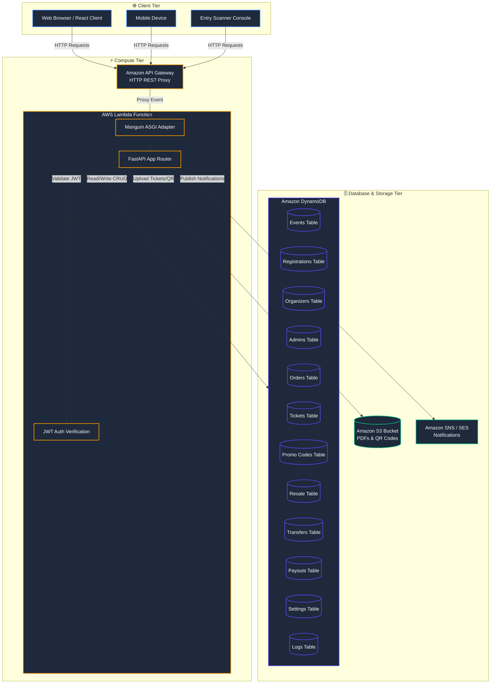

# 🎟️ AlphaPass (Ticket Hub)
**Serverless Event Ticketing & Resale Platform**

[](https://fastapi.tiangolo.com/)
[](https://www.python.org/)
[](https://www.terraform.io/)
[](#)
[](#)

**AlphaPass (Ticket Hub)** is a secure, high-performance, serverless event management and ticketing platform. It is designed to handle user registration, event creation, secure checkout, PDF ticket generation, and a secondary market featuring capped-price ticket resales and transfers.

This project is part of the **Azubi Cloud & AI Academy Internship Portfolio (Project 2 — Team Alpha)**.

---

## 🏛️ Platform Architecture

The system utilizes a fully serverless AWS architecture:
* **API Gateway:** Proxies all HTTP traffic to the backend Lambda execution handler.
* **AWS Lambda (Python 3.12 + FastAPI + Mangum):** Serves API logic dynamically without persistent instance overhead, wrapped using the `Mangum` ASGI adapter.
* **Amazon DynamoDB:** Serves as the serverless database layer using 12 specialized tables for structured data records.
* **AWS S3:** Houses generated ticket PDFs, QR code images, and uploaded event banners.
* **AWS SNS:** Dispatches real-time booking alerts and verification links.



---

## 📁 Repository Directory Structure

```text
alphapass/
├── backend/                  # FastAPI Application Code
│   ├── app/                  # Main business logic
│   │   ├── core/             # JWT Security, config settings
│   │   ├── db/               # DynamoDB database helper & session configuration
│   │   ├── routers/          # API Controllers (Events, Checkin, Payouts, Resale, etc.)
│   │   └── schemas/          # Pydantic validation schemas
│   ├── tests/                # Test suite (SQL database and Moto DynamoDB tests)
│   ├── index.py              # AWS Lambda Entrypoint (Mangum ASGI Handler)
│   └── requirements.txt      # Python dependencies
├── frontend/                 # Client UI
│   ├── index.html            # Web entry point
│   └── frontend_guide.md     # Detailed SPA integration guide
├── infra/                    # Terraform Infrastructure-as-code
│   ├── modules/              # Infrastructure Modules (DynamoDB, Lambda, SNS, S3, APIGW)
│   ├── main.tf               # Global orchestration
│   └── variables.tf          # Variable parameters
└── .secrets/                 # Trello task mapping configurations
```

---

## 💾 Serverless Database Schema (DynamoDB)

The system deploys 12 dedicated DynamoDB tables defined in Terraform:

| Table Name | Primary Hash Key | Description |
|---|---|---|
| `alphapass-events-[env]` | `EventID` | Event metadata, schedule, and nested ticket types |
| `alphapass-registrations-[env]` | `RegistrationID` | Attendee reservations linked to orders |
| `alphapass-organizers-[env]` | `OrganizerID` | Registered event organizer profiles and status |
| `alphapass-admins-[env]` | `AdminID` | Platform administrator profiles and superuser status |
| `alphapass-orders-[env]` | `OrderID` | Financial orders, payment references, and total counts |
| `alphapass-tickets-[env]` | `TicketID` | Unique tickets, validation keys, and scanned status |
| `alphapass-promo-codes-[env]` | `Code` | Discount codes, type (percentage/fixed), and usage bounds |
| `alphapass-resale-listings-[env]` | `ListingID` | Listed tickets for secondary market purchase |
| `alphapass-transfers-[env]` | `TransferID` | Log of historical ticket transfers between users |
| `alphapass-payouts-[env]` | `PayoutID` | Pending and approved organizer payouts |
| `alphapass-platform-settings-[env]` | `SettingKey` | Core configuration limits (e.g. commission rate) |
| `alphapass-audit-logs-[env]` | `LogID` | Action logs tracking platform-wide changes |

---

## 🚀 Local Development Setup

### 1. Backend API Execution
1. Navigate to the backend directory, create a virtual environment, and install dependencies:
   ```bash
   cd backend
   python3 -m venv .venv
   source .venv/bin/activate
   pip install -r requirements.txt
   ```
2. Copy environment template and configure settings:
   ```bash
   cp .env.example .env
   ```
3. Run the development server locally:
   ```bash
   uvicorn app.main:app --reload --port 8000
   ```
4. Access interactive documentation:
   * **Swagger UI:** [http://localhost:8000/docs](http://localhost:8000/docs)
   * **ReDoc:** [http://localhost:8000/redoc](http://localhost:8000/redoc)

### 2. Running Tests
Run the standard pytest suite (combining local SQLAlchemy database tests and mocked AWS DynamoDB tests using `moto`):
```bash
pytest
```

---

## 🛠️ Infrastructure Provisioning (Terraform)

To build and deploy the AWS serverless architecture:

1. Navigate to the infrastructure folder:
   ```bash
   cd infra
   ```
2. Initialize backend modules:
   ```bash
   terraform init
   ```
3. Validate configuration files:
   ```bash
   terraform validate
   ```
4. Perform dry run analysis:
   ```bash
   terraform plan
   ```
5. Deploy to AWS:
   ```bash
   terraform apply
   ```

---

## 👥 Team Alpha (Project Contributors)
* **Azubi-AWS-AI Internship Program**
* **Project Reference:** Project 2 (Team Alpha Portfolio)
