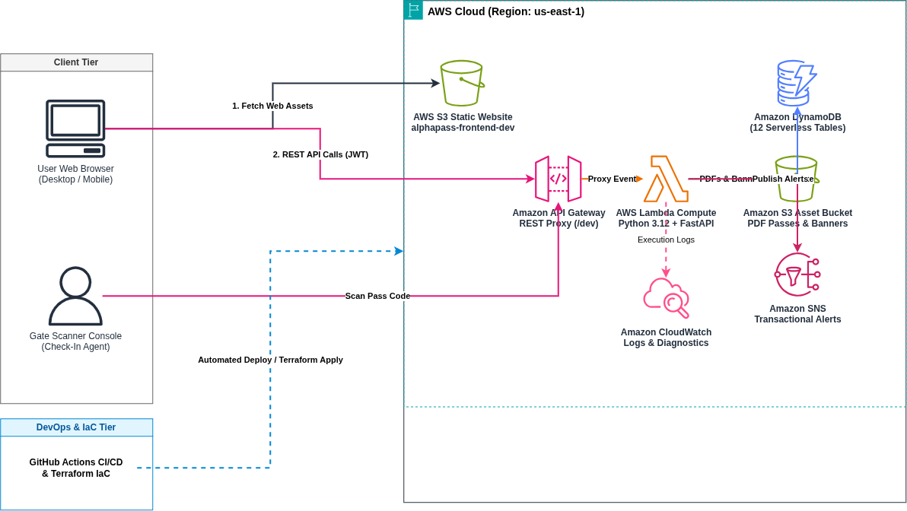

# AlphaPass (Ticket Hub)
**Serverless Event Ticketing, Secondary Resale Market & Governance Platform**

[](https://fastapi.tiangolo.com/)
[](https://www.python.org/)
[](https://www.terraform.io/)
[](#)
[](#)

AlphaPass is a secure, high-performance, serverless event management, ticketing, and resale platform built on Amazon Web Services (AWS) using FastAPI and DynamoDB. It provides digital pass code generation, printable PDF ticket downloads, gate check-in scanning, an organizer management dashboard with governance controls, price-capped secondary ticket resales, peer-to-peer ticket transfers, and administrative platform governance queues.

Part of the **Azubi Cloud & AI Academy Internship Portfolio (Project 2 — Team Alpha)**.

---

## Project Documentation Hub

All technical architecture, DevOps pipelines, developer manuals, presentation materials, and live demonstration scripts are organized under the [`docs/`](docs/) directory:

- **[Infrastructure Guide (`docs/INFRASTRUCTURE.md`)](docs/INFRASTRUCTURE.md):** Complete AWS serverless topology, 13 DynamoDB table definitions, API Gateway REST proxy, Lambda compute specs, S3 hosting, and IAM least-privilege policies.
- **[CI/CD & DevOps Manual (`docs/CICD.md`)](docs/CICD.md):** GitHub Actions automated multi-stage pipeline, `pytest` test runner, Terraform automation, pre-deploy sanitation scripts, dynamic API URL injection, and teardown workflows.
- **[Backend Architecture Guide (`docs/BACKEND.md`)](docs/BACKEND.md):** FastAPI modular router breakdown (10 routers), Mangum ASGI wrapper, ReportLab PDF ticket generator, Boto3 DynamoDB DAO helpers, and test suite details.
- **[OpenAPI Reference (`docs/API_REFERENCE.md`)](docs/API_REFERENCE.md):** Full REST API specification and request/response schemas.
- **[SDK Integration Guide (`docs/integration.md`)](docs/integration.md):** Frontend-Backend JS SDK (`app-api.js`) and API integration patterns.

---

## Core Features & Modules

- **Public Event Explorer & Discovery**: Browse published events with category filtering, keyword search, city filtering, and price indicators.
- **Single Event Details & Tiered Passes**: View event metadata, policies, venue details, and dynamic ticket pass tiers (General Admission, VIP, Early Bird).
- **Cart & Guest Checkout System**: Add multiple passes to cart, apply promo codes with atomic usage validation, execute group purchase discounts, and complete guest orders using Mobile Money or Card payment options.
- **Digital Ticket Pass Codes & Printable PDFs**: Generates formatted unique ticket pass codes and dynamically renders printable PDF tickets using ReportLab.
- **Ticket Pass Wallet & Peer Transfers**: Search tickets by purchaser email or order ID, transfer passes to another attendee with email validation, or list passes on the resale marketplace.
- **Price-Capped Secondary Resale Exchange**: Allows ticket owners to resell tickets on a secondary marketplace enforced with configurable maximum markup percentage caps.
- **Organizer Management Portal**:
  - Event creation with direct S3 cover banner image uploads (`POST /events/upload-banner`).
  - Event policy and resale governance controls (toggles for ticket resale, refunds, transfers, and group purchase discount thresholds).
  - Edit Event Settings modal (`PUT /events/organizer/{id}`).
  - Dynamic ticket pass creation (`POST /events/organizer/{id}/ticket-types`).
  - Real-time revenue and ticket sales analytics dashboard (`GET /organizer/dashboard`).
  - Gate entry pass code check-in scanner (`POST /checkin/scan`).
  - Roster exports in both CSV and printable PDF formats (`GET /organizer/events/{id}/attendees?export=pdf`).
  - Secondary resale activity monitoring modal for organizer events.
- **Admin Governance & Moderation Console**:
  - Platform Governance Queue for reviewing organizer payout requests (`GET /admin/payouts`, `PUT /admin/payouts/{id}/process`).
  - Refund requests moderation queue (`GET /admin/refunds`, `PUT /admin/orders/{id}/refund`).
  - Resale listings moderation queue (`GET /admin/resale`, `PUT /admin/resale/{id}/approve`).
  - Event submission review and approval queue (`GET /admin/events`, `PUT /admin/events/{id}/approve`).
  - Global platform fee and commission configuration (`PUT /admin/config/commission`).
  - Event category management (`POST /admin/categories`).
  - Platform security audit log tracking.

---

## System Architecture



The platform operates on a serverless AWS cloud infrastructure:

- **Frontend Client**: Static web pages hosted on Amazon S3 Website Hosting with Cloudflare Proxy SSL.
- **API Router**: Amazon API Gateway REST Proxy forwarding HTTP requests to AWS Lambda.
- **Compute Layer**: AWS Lambda executing Python 3.12 + FastAPI via Mangum wrapper.
- **Database Storage**: Amazon DynamoDB running single-table and multi-table key-value storage (13 tables).
- **Object Storage**: Amazon S3 bucket storing event banner images and generated PDF ticket passes.
- **Messaging & Alerts**: Amazon SNS/SES for transactional notifications.

---

## Serverless Data Model (DynamoDB Tables)

| Table Name | Hash Key | Purpose & Description |
|---|---|---|
| `alphapass-events-[env]` | `EventID` | Event details, venue, dates, resale/refund toggles, group discount settings, and ticket tiers |
| `alphapass-organizers-[env]` | `OrganizerID` | Event organizer profiles, business details, credentials, and verification status |
| `alphapass-admins-[env]` | `AdminID` | Platform admin accounts, permissions, and superuser flags |
| `alphapass-orders-[env]` | `OrderID` | Orders, guest purchaser details, promo applied, subtotal, and total amounts |
| `alphapass-tickets-[env]` | `TicketID` | Unique ticket passes, ticket codes, attendee info, scan status (`is_used`) |
| `alphapass-resale-listings-[env]` | `ListingID` | Listed resale passes, asking price, face value, seller/buyer details, and status |
| `alphapass-transfers-[env]` | `TransferID` | Peer-to-peer pass transfer audit history |
| `alphapass-promo-codes-[env]` | `Code` | Discount promo codes, percentage off, max usage limits, and usage counts |
| `alphapass-payouts-[env]` | `PayoutID` | Organizer earnings payout requests and settlement status |
| `alphapass-platform-settings-[env]` | `SettingKey` | Core platform settings (commission rate, maintenance mode) |
| `alphapass-audit-logs-[env]` | `LogID` | Governance audit log tracking security events |
| `alphapass-event-categories-[env]` | `CategoryID` | Event category definitions and metadata |
| `alphapass-registrations-[env]` | `RegistrationID` | Registration queues & temporary holds |

---

## Repository Structure

```text
alphapass/
├── backend/                  # FastAPI Application Core
│   ├── app/
│   │   ├── core/             # Security (JWT), Config, S3 Uploader, PDF Generator, Utils
│   │   ├── db/               # DynamoDB Client Helper
│   │   ├── routers/          # 10 API Routers (events, orders, tickets, checkin, admin, resale, etc.)
│   │   └── schemas/          # Pydantic Input/Output Validation Schemas
│   ├── tests/                # Test suite (46 unit & integration tests)
│   ├── index.py              # AWS Lambda Mangum Handler
│   └── requirements.txt      # Python dependencies
├── frontend/                 # Client SPA Web Pages
│   ├── index.html            # Home page & featured events
│   ├── events.html           # Event explorer & search
│   ├── single.html           # Single event details & pass selection
│   ├── cart.html             # Ticket cart & promo code application
│   ├── checkout.html         # Guest checkout & pass confirmation
│   ├── wallet.html           # Ticket wallet & pass transfers
│   ├── resale.html           # Secondary resale market exchange
│   ├── organizer.html        # Organizer portal, event management & gate scanner
│   ├── admin.html            # Admin governance console & moderation queues
│   └── js/                   # Shared API SDK (app-api.js), Config (config.js)
├── docs/                     # Comprehensive Architecture & Integration Docs
│   ├── PRESENTATION.md       # 5-Slide Deck Outline & Team Speaker Notes
│   ├── LIVE_DEMO_GUIDE.md    # Step-by-Step Live Demo Execution Script
│   ├── INFRASTRUCTURE.md     # AWS Serverless & DynamoDB Topology Guide
│   ├── CICD.md               # GitHub Actions Automation & DevOps Pipeline Guide
│   ├── BACKEND.md            # FastAPI Backend & Developer Architecture Guide
│   ├── API_REFERENCE.md      # Full OpenAPI Specification & Endpoint Reference
│   └── integration.md        # Full Frontend-Backend SDK Integration Guide
├── infra/                    # Terraform Infrastructure-as-Code Modules
│   ├── modules/              # DynamoDB, Lambda, S3, APIGW, SNS, CloudWatch, Budgets modules
│   └── main.tf               # Terraform main execution file
└── README.md                 # Project Overview & Operational Documentation
```

---

## Local Development Setup

### 1. Environment Setup & Dependencies
```bash
cd backend
python3 -m venv .venv
source .venv/bin/activate
pip install -r requirements.txt
```

### 2. Configure Local Environment Variables
```bash
cp .env.example .env
```

### 3. Run FastAPI Development Server
```bash
uvicorn app.main:app --reload --port 8000
```
- **Swagger UI:** [http://localhost:8000/docs](http://localhost:8000/docs)
- **ReDoc:** [http://localhost:8000/redoc](http://localhost:8000/redoc)

### 4. Execute Unit & Integration Test Suite
```bash
pytest -v
```

---

## Infrastructure Provisioning (Terraform Direct Serverless Stack)

This project uses an automated Direct Serverless Stack on AWS (AWS Lambda ZIP + API Gateway REST Proxy + S3 Website Hosting + DynamoDB).

```bash
# 1. Provision AWS Infrastructure
cd infra/
terraform init
terraform plan -var="environment=dev"
terraform apply -var="environment=dev" -auto-approve

# 2. Capture Infrastructure Outputs
export BUCKET_NAME=$(terraform output -raw frontend_bucket_name)
export API_ENDPOINT=$(terraform output -raw api_endpoint)

# 3. Deploy Frontend Assets to S3
aws s3 sync ../frontend/ s3://$BUCKET_NAME --delete --cache-control "max-age=3600,public"
```

---

## CI/CD Pipelines & Automated Teardown

- **Deployment Pipeline ([.github/workflows/deploy.yml](.github/workflows/deploy.yml))**: Automated testing via `pytest`, infrastructure provisioning with Terraform, Lambda ZIP updating, dynamic API Gateway URL injection into `frontend/js/config.js`, and S3 asset synchronization.
- **Teardown Pipeline ([.github/workflows/teardown.yml](.github/workflows/teardown.yml))**: Infrastructure destruction from GitHub Actions UI. Deletes versioned S3 objects, clears DynamoDB tables, and tears down provisioned AWS resources.

---

## Team Alpha (Project Contributors)
- **Mustapha Haadi** — Developer (Team Lead)
- **David Yirenkyi** — Developer
- **Emmanuel Yelisomah** — Developer
- **Daniel Hanson Reynolds** — Developer
- **Zakaria Adeeba** — Developer
- **Evame Cobblah** — Developer
- **Azubi Cloud & AI Academy Internship Program (Project 2 Portfolio)**
