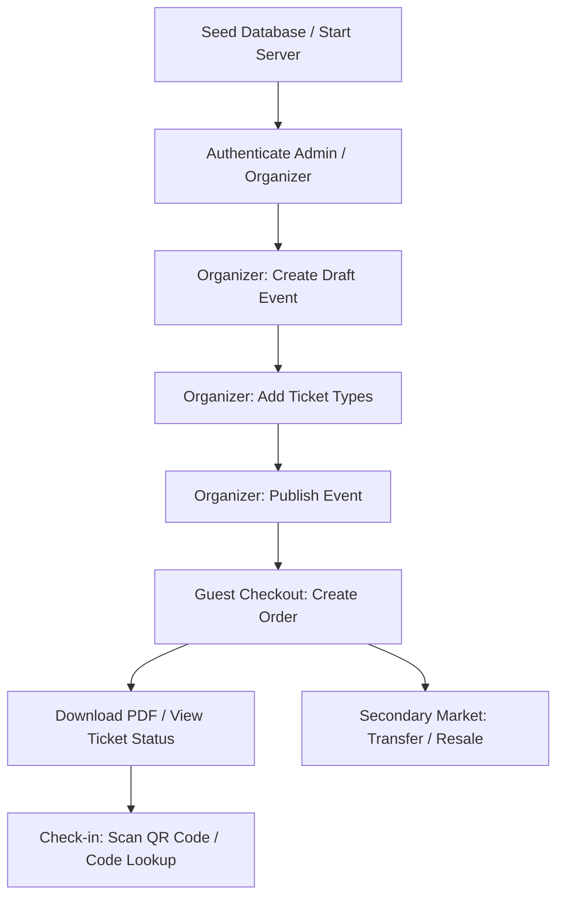

# 🔍 Ticket Hub API Testing Guide

Welcome to the comprehensive testing guide for the **Ticket Hub (AlphaPass)** backend. This document provides step-by-step instructions to test all REST API endpoints using either **Swagger UI (Interactive Docs)** or **Postman**.

---

## 🗺️ Testing Workflows Overview

Before jumping into the tools, here is the lifecycle flow of the application that you will be testing:



---

## 🛠️ Prerequisites & Setup

### 1. Ensure the Backend Server is Running
Your FastAPI development server should be running locally:
```bash
# From the backend/ directory
source .venv/bin/activate
uvicorn app.main:app --reload --port 8000
```
* **Base URL:** `http://localhost:8000`
* **Swagger UI URL:** `http://localhost:8000/docs`
* **ReDoc URL:** `http://localhost:8000/redoc`

### 2. Reset and Seed Database
If you want a clean database pre-populated with categories, mock events, and default credentials, run the seed script:
```bash
# Upgrade schema to latest migration
alembic upgrade head

# Run the seeding script
python -m app.db.seed
```

> [!NOTE]
> **Pre-seeded Accounts for Testing:**
> * **Platform Admin:** `admin@ticket-hub.com` / `Password123`
> * **Event Organizer:** `organizer@ticket-hub.com` / `Password123`

---

## 🌐 Option 1: Testing via Swagger UI

FastAPI provides an interactive web interface directly connected to the OpenAPI schema.

### Step 1: Open the Interactive Docs
1. Open your browser and navigate to `http://localhost:8000/docs`.
2. You will see endpoints grouped by tags (e.g., **Auth**, **Events**, **Orders**, **Check-in**, etc.).

### Step 2: Authentication & Authorization
Since organizer and admin actions require JWT tokens, you need to authenticate:

1. Locate the **Auth** section and expand the login endpoint matching your role:
   * For Organizers: `POST /auth/organizer/login`
   * For Admins: `POST /auth/admin/login`
2. Click **Try it out** on the right side.
3. In the Request body, fill in the email and password:
   ```json
   {
     "email": "organizer@ticket-hub.com",
     "password": "Password123"
   }
   ```
4. Click the large blue **Execute** button.
5. In the response body, locate the `access_token` string:
   ```json
   {
     "access_token": "eyJhbGciOiJIUzI1NiIsInR5...",
     "role": "organizer"
   }
   ```
6. Copy the raw `access_token` string.
7. Scroll to the top of the Swagger page and click the green **Authorize** button on the right.
8. Paste the `access_token` value into the **Value** text field and click **Authorize**, then click **Close**.

> [!IMPORTANT]
> The Swagger interface handles the `Bearer` prefix automatically. Once authorized, a lock icon will appear closed beside all secure endpoints, meaning your token is attached to every future request header.

---

### Step 3: Walk-through Workflows in Swagger

#### Workflow A: Create & Publish an Event (Organizer Role)
1. **Create the Event:**
   * Go to `POST /events/organizer` (Create Event).
   * Fill in the request body (e.g., edit titles, starts/ends dates, etc.) and execute it.
   * Copy the returned `"id"` (the event UUID) from the response.
2. **Add a Ticket Type:**
   * Go to `POST /events/organizer/{event_id}/ticket-types` (Create Ticket Type).
   * Paste the copied `event_id` into the path parameter.
   * Fill in details like price, quantity, and limit in the body, then execute.
3. **Publish the Event:**
   * Go to `POST /events/organizer/{event_id}/publish` (Publish Event).
   * Provide the `event_id` and execute. Your event is now publicly discoverable!

#### Workflow B: Guest Checkout (Public Role)
1. **Browse Events:**
   * Expand `GET /events` (List Events).
   * Execute to confirm your published event and its `ticket_types` are returned. Note the `ticket_type_id`.
2. **Purchase Tickets:**
   * Expand `POST /orders` (Create Order).
   * Fill in the request body with the `event_id`, guest name, guest email, and the `ticket_type_id`:
     ```json
     {
       "event_id": "YOUR_EVENT_UUID",
       "guest_name": "Alice Johnson",
       "guest_email": "alice@example.com",
       "items": [
         {
           "ticket_type_id": "YOUR_TICKET_TYPE_UUID",
           "quantity": 2
         }
       ]
     }
     ```
   * Execute the order. Note the returned order details and the `ticket_code` fields inside the `tickets` array (e.g., `TC-XXXX-XXXX`).

#### Workflow C: Ticket Scanning & Check-in (Staff Role)
1. **Manual Ticket Verification:**
   * Expand `GET /checkin/ticket/{ticket_code}`.
   * Paste a ticket code and execute. It will show the ticket info and confirm whether it is valid for entry.
2. **Check-in/Scan Ticket:**
   * Expand `POST /checkin/scan`.
   * Submit the ticket code:
     ```json
     {
       "ticket_code": "TC-XXXX-XXXX"
     }
     ```
   * Execute. The ticket status will update to `used`. Executing a scan on the same ticket code a second time will return a `valid: false` check-in rejection message.

---

## 🚀 Option 2: Testing via Postman

If you prefer testing with Postman, you can build a collection to organize your requests.

### Step 1: Create a Collection and Configure Variables
1. Create a new collection in Postman named **Ticket Hub API**.
2. Click the collection, navigate to the **Variables** tab, and add the following:
   * `base_url` = `http://localhost:8000`
   * `organizer_token` = *(leave blank for now)*
   * `admin_token` = *(leave blank for now)*
   * `event_id` = *(leave blank for now)*
   * `ticket_code` = *(leave blank for now)*

### Step 2: Set Up Automated Token Saving (Optional but Recommended)
Instead of copying and pasting tokens manually, you can automate token storage using Postman's **Tests** tab scripts.

1. **Add Request:** Create a `POST` request to `{{base_url}}/auth/organizer/login`.
2. Under the **Body** tab, select `raw` -> `JSON` and paste:
   ```json
   {
     "email": "organizer@ticket-hub.com",
     "password": "Password123"
   }
   ```
3. Navigate to the **Tests** tab of the request and add the following JavaScript:
   ```javascript
   if (pm.response.code === 200) {
       var jsonData = pm.response.json();
       pm.collectionVariables.set("organizer_token", jsonData.access_token);
   }
   ```
4. Repeat the same steps for `POST {{base_url}}/auth/admin/login` using the Admin credentials, saving to the variable `admin_token`:
   ```javascript
   if (pm.response.code === 200) {
       var jsonData = pm.response.json();
       pm.collectionVariables.set("admin_token", jsonData.access_token);
   }
   ```

### Step 3: Add Authorization to Protected Requests
For any request that requires an active session:
1. Click the request in Postman, open the **Authorization** tab.
2. Set **Type** to **Bearer Token**.
3. Set the **Token** field to `{{organizer_token}}` (or `{{admin_token}}` depending on the role required).

---

### Step 4: Key Postman Requests to Build

| Endpoint / Action | Method | Path | Auth / Headers | Payload (JSON) |
|---|---|---|---|---|
| **Health Check** | `GET` | `{{base_url}}/health` | None | None |
| **Organizer Login** | `POST` | `{{base_url}}/auth/organizer/login` | None | `{"email": "...", "password": "..."}` |
| **Create Event** | `POST` | `{{base_url}}/events/organizer` | Bearer `{{organizer_token}}` | Event creation parameters (dates, venue, etc.) |
| **Create Ticket Type** | `POST` | `{{base_url}}/events/organizer/{{event_id}}/ticket-types` | Bearer `{{organizer_token}}` | `{"name": "VIP", "price": 100.0, "quantity": 50}` |
| **Publish Event** | `POST` | `{{base_url}}/events/organizer/{{event_id}}/publish` | Bearer `{{organizer_token}}` | None |
| **Browse Public Events** | `GET` | `{{base_url}}/events` | None | None |
| **Place Order (Guest)** | `POST` | `{{base_url}}/orders` | None | `{"event_id": "...", "guest_name": "...", ...}` |
| **Ticket Status** | `GET` | `{{base_url}}/tickets/{{ticket_code}}/status` | None | None |
| **Scan Ticket** | `POST` | `{{base_url}}/checkin/scan` | None | `{"ticket_code": "{{ticket_code}}"}` |

---

## 🧪 Option 3: Running Automated Tests

A comprehensive integration/unit test suite exists under the `tests/` directory. These tests automatically spin up mock instances and execute full API transactions.

To run these tests from the command line:
```bash
# Make sure your virtual environment is active
source .venv/bin/activate

# Execute pytest
pytest -v
```

> [!TIP]
> **Mocking Info:** All tests that integrate with AWS S3 (e.g. for PDFs/banners) and AWS SES (for emails) use `moto`. No actual network requests are made to AWS during tests.

---

## 🩺 Troubleshooting Common Issues

* **Error: `401 Unauthorized` or `Invalid token`**
  * Check if your JWT token has expired. Log in again to retrieve a fresh token.
  * Ensure the token is passed in the headers as: `Authorization: Bearer <your_token>`.
* **Error: `403 Forbidden`**
  * You are trying to access an Admin route with an Organizer token, or vice versa.
  * Your organizer account is not verified. (By default, the seed script creates an organizer with status `active` and `email_verified=True` to bypass this during local dev).
* **Database out of sync**
  * If you add new models or modify existing attributes, run:
    ```bash
    alembic revision --autogenerate -m "describe change"
    alembic upgrade head
    ```
