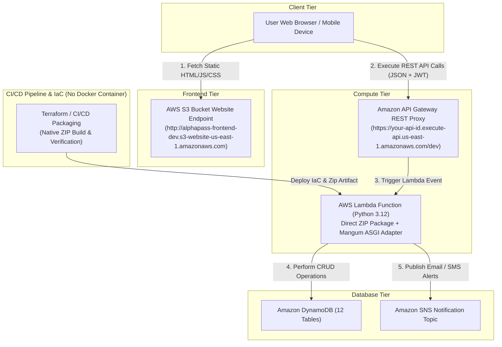

# 🎟️ AlphaPass Serverless Deployment Options & Architecture Strategy

This document provides a comprehensive analysis and deployment playbook for **AlphaPass** (Serverless Event Ticketing & Resale Platform). Based on a complete audit of the codebase (`backend/`, `frontend/`, `infra/`), the deployment strategy has been finalized to **Option 2 (Automated Direct Serverless Stack without Docker)**.

---

## 🔍 Codebase Audit & Infrastructure Context

| Component | Repository Location | Technology Stack | Cloud Resource Target |
| :--- | :--- | :--- | :--- |
| **Frontend SPA** | `frontend/` | Vanilla HTML5, CSS3, JS SDK ([js/app-api.js](file:///home/haadi/Desktop/AWS%20Cloud/Azubi-AWS-AI/Team%20Alpha/alphapass/frontend/js/app-api.js)) | AWS S3 Static Website Hosting |
| **Compute Engine** | `backend/app/` | Python 3.12, FastAPI, Mangum ASGI Handler ([index.py](file:///home/haadi/Desktop/AWS%20Cloud/Azubi-AWS-AI/Team%20Alpha/alphapass/backend/index.py)) | AWS Lambda (Direct ZIP Package) |
| **API Interface** | `infra/modules/api_gateway` | REST API Gateway Proxy (`/{proxy+}`) | Amazon API Gateway |
| **Data Storage** | `backend/app/db/` | Boto3 DynamoDB Client (12 Tables) | Amazon DynamoDB (On-Demand) |
| **Notifications** | `infra/modules/sns` | AWS SNS Topic & Subscriptions | Amazon SNS / SES |
| **IaC Orchestration**| `infra/` | Terraform `>= 1.5.0` Modular Configurations | AWS Resource Management |

---

## ⚡ Option 1: Legacy Serverless ZIP Stack
> **STATUS**: Alternative / Manual Baseline

### Key Technical Details
- **Frontend**: Uploaded to `alphapass-frontend-${var.environment}` S3 bucket configured for static website hosting.
- **Backend Compute**: Python source code packaged manually via `.zip` archive containing `backend/index.py` (Mangum ASGI adapter).
- **Cost**: $0 base fee. Pay strictly per Lambda execution ms and DynamoDB units.

---

## 🚀 Option 2: Automated Direct Serverless Stack (AWS Lambda ZIP + API Gateway + S3 Direct Website + DynamoDB) — [SELECTED DEPLOYMENT STRATEGY]
> **STATUS**: ✅ **OFFICIALLY SELECTED PRODUCTION STRATEGY** (Pure Serverless, CI/CD Ready, No Docker Overhead)

### Architecture & Communication Flow



### Key Technical Details
- **No Docker Dependency**: Eliminates Docker container builds, Docker daemon requirements, and ECR storage fees (~$0.10/GB/month). Keeps deployment lightweight and 100% serverless.
- **Backend Build**: Python code & dependencies packaged directly into standard Lambda ZIP artifact (`backend/index.py` with `Mangum` adapter).
- **CI/CD Integration**: Infrastructure and application code deployed automatically via Terraform and CI/CD automation without needing Docker or container registries.
- **Frontend Hosting**: Static assets synchronized to `alphapass-frontend-${var.environment}` S3 bucket with public website hosting enabled.
- **Cost & Maintenance**: $0 idle cost. Maximum cost-efficiency, sub-second cold starts, zero container maintenance.

### Deployment Commands
```bash
# 1. Provision Infrastructure & Deploy Lambda ZIP via Terraform
cd infra/
terraform init
terraform plan -var="environment=dev"
terraform apply -var="environment=dev" -auto-approve

# 2. Capture Environment Outputs
export S3_BUCKET=$(terraform output -raw frontend_bucket_name)
export API_URL=$(terraform output -raw api_endpoint)
export FRONTEND_URL=$(terraform output -raw frontend_website_endpoint)

# 3. Sync Frontend Static Website Assets to AWS S3
aws s3 sync ../frontend/ s3://$S3_BUCKET --delete --cache-control "max-age=3600,public"
```

---

## 🐳 Option 3: Containerized Serverless Stack (AWS App Runner / ECR)
> **STATUS**: Excluded / Deprecated (Requires Docker containers & continuous container infrastructure fees)

---

## 📊 Comparative Analysis Matrix

| Feature / Criteria | **Option 1: Legacy Manual ZIP** | **Option 2: Automated Direct Serverless (SELECTED)** | **Option 3: Containerized ECR / App Runner** |
| :--- | :--- | :--- | :--- |
| **Infrastructure Type** | Manual Serverless | **Pure Serverless + CI/CD Ready** | Serverless Container |
| **Docker Required?** | No | **No (Docker Removed)** | Yes (Requires Docker & ECR) |
| **Cold Start Latency** | ~200ms - 400ms | **~150ms - 300ms** | 0ms - 800ms |
| **Idle Monthly Cost** | $0.00 | **$0.00 (Zero Idle Cost)** | ~$5.00 - $15.00 |
| **Deployment Artifact** | Manual ZIP file | **Automated ZIP + Terraform IaC** | ECR Container Image |
| **Deployment Complexity**| Manual | **Streamlined & Fast** | High (Docker build & push) |
| **Best Target Scenario** | Local Testing | **Official Team Alpha Production Standard** | High-Concurrency Legacy Apps |

---

## 🔄 GitHub Actions CI/CD Pipeline & Manual Teardown

The repository includes fully automated GitHub Actions CI/CD workflows under `.github/workflows/`:

### 1. Automated Deployment Pipeline ([.github/workflows/deploy.yml](file:///home/haadi/Desktop/AWS%20Cloud/Azubi-AWS-AI/Team%20Alpha/alphapass/.github/workflows/deploy.yml))
Triggers automatically on `push` or `pull_request` to `main`, or manually via **Workflow Dispatch**:

- **Stage 1: Test (`test`)**: Runs full `pytest` suite across all backend unit and integration test cases.
- **Stage 2: Build & Package (`package`)**: Installs dependencies into the Lambda deployment directory.
- **Stage 3: Deploy Infrastructure & Code (`deploy`)**: Initializes Terraform, executes `terraform apply -var="environment=dev" -auto-approve` to provision all AWS serverless resources, deploys the backend package directly to the AWS Lambda function (`aws lambda update-function-code`), and syncs static assets to S3.

### 2. Manual Infrastructure Teardown Button ([.github/workflows/teardown.yml](file:///home/haadi/Desktop/AWS%20Cloud/Azubi-AWS-AI/Team%20Alpha/alphapass/.github/workflows/teardown.yml))
Provides an interactive button on the **GitHub Actions UI** to tear down / destroy all provisioned AWS infrastructure:

1. Navigate to **GitHub Actions** tab -> **AlphaPass Infrastructure Teardown**.
2. Click **Run workflow**.
3. Type `"DESTROY"` into the confirmation box to authorize `terraform destroy -var="environment=dev" -auto-approve`.

### Required GitHub Secrets
Configure the following secrets under **Settings > Secrets and variables > Actions**:
- `AWS_ACCESS_KEY_ID`: IAM User Access Key with permissions for Lambda, S3, DynamoDB, APIGW, SNS, CloudWatch, Budgets.
- `AWS_SECRET_ACCESS_KEY`: IAM User Secret Key.
- `AWS_REGION`: Deployment region (default: `us-east-1`).

---

## 🎯 Final Recommendation & Selected Action Plan

For **AlphaPass (Project 2 — Team Alpha)**, **Option 2 (Automated Direct Serverless Stack - No Docker)** has been **OFFICIALLY SELECTED** as the production architecture strategy.

Key Highlights of Option 2 Choice:
1. **Zero Container Overhead**: Docker dependency has been removed from cloud deployment, avoiding Docker daemon requirements and ECR registry storage costs.
2. **CI/CD Compatibility**: Uses direct Terraform `.zip` packaging for fast, zero-downtime serverless deployments.
3. **100% Serverless Cost Savings**: Zero base monthly cost ($0.00 when idle). Pay strictly per API Gateway call, Lambda millisecond, and DynamoDB operation.

