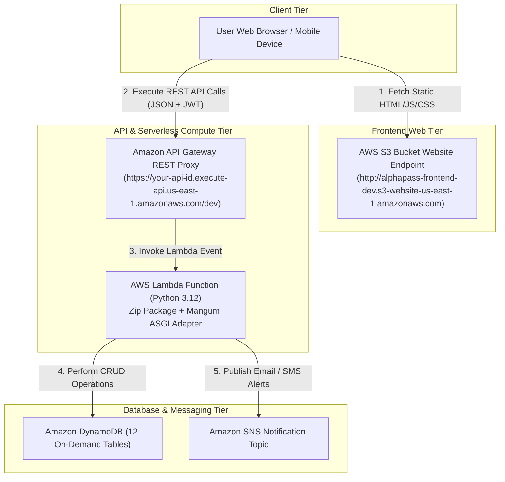
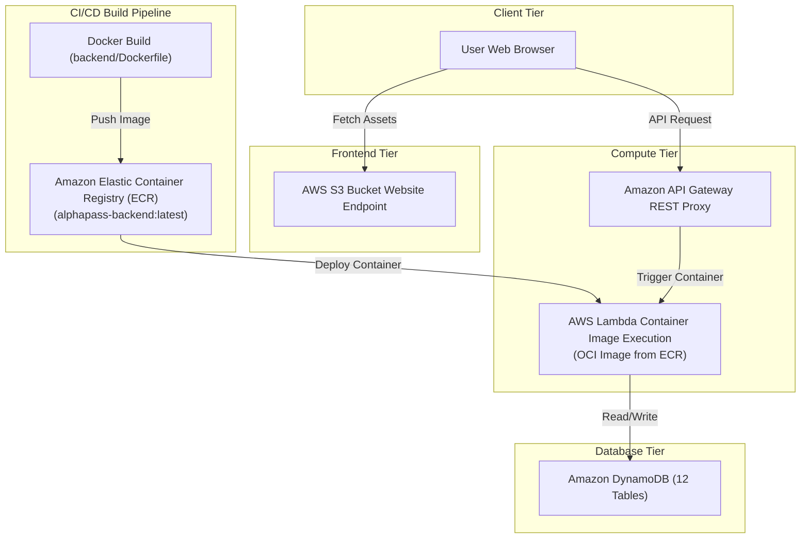
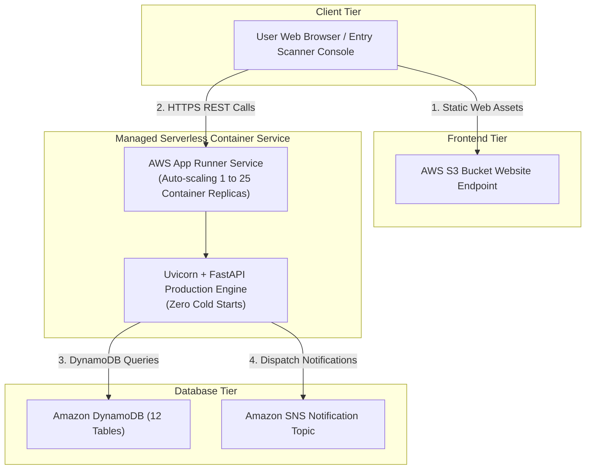

# 🎟️ AlphaPass Serverless Deployment Options & Architecture Strategy

This document provides a comprehensive analysis and deployment playbook for **AlphaPass** (Serverless Event Ticketing & Resale Platform). Based on a complete audit of the codebase (`backend/`, `frontend/`, `infra/`, `compose.yml`, `Dockerfile`), three distinct **100% Serverless Deployment Options** have been designed to fit different operational, CI/CD, and scaling requirements.

---

## 🔍 Codebase Audit & Infrastructure Context

| Component | Repository Location | Technology Stack | Cloud Resource Target |
| :--- | :--- | :--- | :--- |
| **Frontend SPA** | `frontend/` | Vanilla HTML5, CSS3, JS SDK ([js/app-api.js](file:///home/haadi/Desktop/AWS%20Cloud/Azubi-AWS-AI/Team%20Alpha/alphapass/frontend/js/app-api.js)) | AWS S3 Static Website Hosting |
| **Compute Engine** | `backend/app/` | Python 3.12, FastAPI, Mangum ASGI Handler ([index.py](file:///home/haadi/Desktop/AWS%20Cloud/Azubi-AWS-AI/Team%20Alpha/alphapass/backend/index.py)) | AWS Lambda / ECR / App Runner |
| **API Interface** | `infra/modules/api_gateway` | REST API Gateway Proxy (`/{proxy+}`) | Amazon API Gateway |
| **Data Storage** | `backend/app/db/` | Boto3 DynamoDB Client (12 Tables) | Amazon DynamoDB (On-Demand) |
| **Notifications** | `infra/modules/sns` | AWS SNS Topic & Subscriptions | Amazon SNS / SES |
| **IaC Orchestration**| `infra/` | Terraform `>= 1.5.0` Modular Configurations | AWS Resource Management |

---

## ⚡ Option 1: Native Serverless ZIP Stack (AWS Lambda ZIP + API Gateway + S3 Direct Website + DynamoDB)
> **STATUS**: Recommended for Standard Serverless Portfolio & Maximum Cost-Efficiency (Pay-Per-Request)

### Architecture & Communication Flow



### Key Technical Details
- **Frontend**: Uploaded to `alphapass-frontend-${var.environment}` S3 bucket configured for static website hosting (`index.html` suffix, `404.html` error document).
- **Backend Compute**: Python source code packaged into `.zip` archive containing `backend/index.py` (Mangum ASGI adapter) and Python dependencies.
- **Routing**: API Gateway proxies `/{proxy+}` catch-all routes to Lambda.
- **Cost**: $0 base fee. Pay strictly per Lambda execution ms and DynamoDB read/write units.

### Deployment Commands
```bash
# 1. Provision Infrastructure via Terraform
cd infra/
terraform init
terraform apply -var="environment=dev" -auto-approve

# 2. Extract Outputs
export S3_BUCKET=$(terraform output -raw frontend_bucket_name)
export API_URL=$(terraform output -raw api_endpoint)

# 3. Package & Sync Frontend to S3
aws s3 sync ../frontend/ s3://$S3_BUCKET --delete --cache-control "max-age=3600,public"
```

### Pros & Cons
- ✅ **Pros**: Zero idle cost, fastest deployment time (< 2 minutes), natively managed scaling.
- ❌ **Cons**: Cold start latency (~200–500ms) on initial request after idle periods.

---

## 🐳 Option 2: Containerized Serverless Lambda Stack (Lambda ECR Image + API Gateway + S3 Direct Website + DynamoDB)
> **STATUS**: Recommended for Standardized Docker CI/CD Pipelines & Large Packages

### Architecture & Communication Flow



### Key Technical Details
- **Backend Build**: Uses `backend/Dockerfile` with `public.ecr.aws/lambda/python:3.12` base image.
- **ECR Repository**: Container image built locally or in GitHub Actions and pushed to Amazon ECR (`alphapass-backend-dev:latest`).
- **Lambda Function**: Configured with `package_type = "Image"` referencing ECR URI.

### Deployment Commands
```bash
# 1. Build and Tag Docker Image for AWS Lambda
cd backend/
docker build -t alphapass-backend:latest .

# 2. Authenticate and Push to Amazon ECR
aws ecr get-login-password --region us-east-1 | docker login --username AWS --password-stdin $AWS_ACCOUNT_ID.dkr.ecr.us-east-1.amazonaws.com
docker tag alphapass-backend:latest $AWS_ACCOUNT_ID.dkr.ecr.us-east-1.amazonaws.com/alphapass-backend:latest
docker push $AWS_ACCOUNT_ID.dkr.ecr.us-east-1.amazonaws.com/alphapass-backend:latest

# 3. Apply Terraform with ECR Container URI
cd ../infra/
terraform apply -var="environment=dev" -var="use_container_image=true"
```

### Pros & Cons
- ✅ **Pros**: Standardized Docker environment matching `compose.yml`, removes 250MB Lambda ZIP size limit, consistent binary dependencies.
- ❌ **Cons**: ECR container storage cost (~$0.10/GB/month), slightly longer initial container warm-up.

---

## 🚀 Option 3: Managed Container Serverless Stack (AWS App Runner + API Gateway / Direct HTTPS + S3 Direct Website + DynamoDB)
> **STATUS**: Recommended for Zero Cold-Start Requirements & High-Concurrency Ticket Drops

### Architecture & Communication Flow



### Key Technical Details
- **Container Service**: AWS App Runner continuously runs `backend/Dockerfile` (`uvicorn app.main:app --host 0.0.0.0 --port 8000`).
- **Auto-Scaling**: Automatically scales active container instances up/down based on HTTP concurrency (e.g. scale out when concurrent requests exceed 100).
- **HTTPS Endpoint**: App Runner provides a natively managed TLS/SSL domain (`https://xxxxxx.us-east-1.awsapprunner.com`).

### Deployment Commands
```bash
# 1. Build and Push Container Image to ECR
cd backend/
docker build -t alphapass-apprunner:latest .
docker push $AWS_ACCOUNT_ID.dkr.ecr.us-east-1.amazonaws.com/alphapass-apprunner:latest

# 2. Deploy AWS App Runner via Terraform
cd ../infra/
terraform apply -var="environment=dev" -var="enable_app_runner=true"
```

### Pros & Cons
- ✅ **Pros**: Absolutely zero cold starts, handles long connections and high-throughput ticket sales spikes (10,000+ req/sec), native continuous deployment from ECR.
- ❌ **Cons**: Low continuous base cost (~$5–$15/month for 1 active container instance).

---

## 📊 Comparative Analysis Matrix

| Feature / Criteria | **Option 1: Lambda ZIP** | **Option 2: Lambda ECR Container** | **Option 3: AWS App Runner** |
| :--- | :--- | :--- | :--- |
| **Infrastructure Type** | Pure Serverless FaaS | Serverless Container FaaS | Serverless Container PaaS |
| **Cold Start Latency** | ~200ms - 400ms | ~400ms - 800ms | **0ms (Zero Cold Start)** |
| **Idle Monthly Cost** | **$0.00** | ~$0.10 (ECR storage) | ~$5.00 - $12.00 |
| **Deployment Artifact** | `.zip` source bundle | Docker ECR Container Image | Docker ECR Container Image |
| **Package Limit** | 50MB zipped / 250MB unzipped | **10GB Container Image** | **10GB Container Image** |
| **Deployment Complexity**| Extremely Simple | Intermediate (Requires ECR) | Intermediate |
| **Scaling Mechanism** | Automatic per request | Automatic per request | Automatic per concurrency |
| **Best Target Scenario** | Azubi Internship Project / MVP | Containerized Team Pipelines | High-Traffic Ticket Drops |

---

## 🎯 Final Recommendation & Next Steps

For **AlphaPass (Project 2 — Team Alpha)**, **Option 1 (Native Serverless ZIP Stack)** is recommended as the primary production strategy for its **zero idle cost**, **fast execution**, and **seamless Terraform integration**. **Option 2** serves as the ideal upgrade path if container image standardization is desired for CI/CD automation.

To deploy Option 1 immediately:
1. Run `cd infra/ && terraform apply -var="environment=dev"`.
2. Sync static assets: `aws s3 sync frontend/ s3://$(terraform output -raw frontend_bucket_name) --delete`.
3. Access the live frontend website via the output `frontend_url`.
