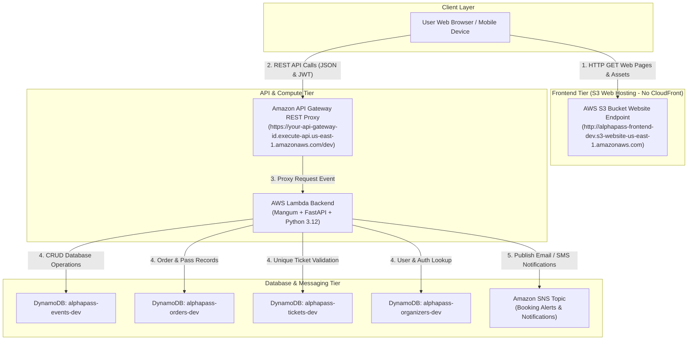

# AlphaPass Pure Serverless System Integration & Deployment Architecture Guide

This guide details the complete end-to-end serverless integration architecture for **AlphaPass** (Event Ticketing & Resale Platform), linking **AWS S3 Direct Static Website Hosting**, **AWS API Gateway**, **AWS Lambda (Python 3.12 + FastAPI + Mangum)**, **Amazon DynamoDB**, and **Amazon SNS**.

---

## 🏛️ 1. Pure Serverless Architecture Overview



---

## 🌐 2. Frontend Infrastructure (S3 Direct Website Hosting)

The frontend is a lightweight Single Page Application (SPA) hosted directly on Amazon S3 without CDN/CloudFront proxies, keeping the deployment 100% serverless, straightforward, and zero-maintenance.

### Key Infrastructure Resources (`infra/modules/s3/`):
- **S3 Bucket (`alphapass-frontend-${var.environment}`)**:
  - `force_destroy = true` for easy terraform lifecycle teardown and replacement.
  - `aws_s3_bucket_website_configuration` configured with `index.html` as the index suffix document and `404.html` as the error document.
  - `aws_s3_bucket_public_access_block` configured to allow public `s3:GetObject` read policy.
  - `aws_s3_bucket_cors_configuration` allows cross-origin requests (`GET`, `HEAD`, `OPTIONS`) from any domain.

---

## 🔗 3. Connecting Frontend SDK (`app-api.js`) to API Gateway

The frontend JavaScript SDK ([frontend/js/app-api.js](file:///home/haadi/Desktop/AWS%20Cloud/Azubi-AWS-AI/Team%20Alpha/alphapass/frontend/js/app-api.js)) manages API communications, authentication state, cart management, and offline demo fallbacks.

### Configuring API Base URL

To point the static web app to your live serverless AWS API Gateway endpoint:

Add the runtime `ALPHAPASS_CONFIG` configuration block before loading `app-api.js`:

```html
<script>
    window.ALPHAPASS_CONFIG = {
        API_BASE_URL: "https://your-api-gateway-id.execute-api.us-east-1.amazonaws.com/dev"
    };
</script>
<script src="js/app-api.js"></script>
```

### Serverless API Gateway Endpoints

| Endpoint Path | HTTP Method | Auth Required | Functionality |
| :--- | :--- | :--- | :--- |
| `/health` | GET | Public | API Health Status Check |
| `/events` | GET | Public | List & Filter Published Events Catalog |
| `/events/{id}` | GET | Public | Single Event Details & Ticket Tier Pricing |
| `/orders` | POST | Guest / Public | Create Ticket Reservation & Pass Code |
| `/orders/lookup` | POST | Public | Retrieve Ticket Pass Wallet by Email |
| `/tickets/{code}/status` | GET | Public | Verify QR Pass Status & Validity |
| `/tickets/{code}/pdf` | GET | Public | Download Printable Pass PDF Ticket |
| `/checkin/scan` | POST | Organizer | Gate Entrance QR Code Scan Check-in |
| `/auth/organizer/login` | POST | Public | Organizer Portal Auth & JWT Issuance |
| `/auth/admin/login` | POST | Public | Admin Moderation Console Auth |

---

## 🚀 4. Step-by-Step Terraform Deployment Instructions

### 1. Provision Infrastructure:
```bash
cd infra/
terraform init
terraform validate
terraform plan -var="environment=dev"
terraform apply -var="environment=dev" -auto-approve
```

### 2. Capture Website Endpoint & API Gateway Outputs:
```bash
export BUCKET_NAME=$(terraform output -raw frontend_bucket_name)
export WEBSITE_ENDPOINT=$(terraform output -raw frontend_website_endpoint)
export API_ENDPOINT=$(terraform output -raw api_endpoint)

echo "Frontend S3 URL: http://$WEBSITE_ENDPOINT"
echo "API Gateway URL: $API_ENDPOINT"
```

---

## 📤 5. Deploying Frontend Code to AWS S3

After provisioning S3 with Terraform, upload the web frontend files:

```bash
aws s3 sync frontend/ s3://$BUCKET_NAME \
  --delete \
  --exclude ".git/*" \
  --cache-control "max-age=3600,public"
```

Once uploaded, open `http://$WEBSITE_ENDPOINT` in any browser to access AlphaPass live!

---

## 🛡️ 6. Backend CORS & FastAPI Configuration

In `backend/app/core/config.py`, whitelist your S3 website endpoint:

```python
CORS_ORIGINS: list[str] = [
    "http://localhost:8000",
    "http://localhost:3000",
    "http://alphapass-frontend-dev.s3-website-us-east-1.amazonaws.com"
]
```

---

## ✅ 7. Verification & Testing Steps

1. **Static S3 Web Access**: Open `http://$WEBSITE_ENDPOINT` and verify pages load immediately with zero infinite loading loops.
2. **Event Explorer & Filtering**: Verify event catalog fetches dynamically from DynamoDB `/events`.
3. **Guest Checkout & QR Passes**: Complete a ticket reservation and download the generated PDF pass.
4. **Organizer & Admin Dashboards**: Login to [organizer.html](file:///home/haadi/Desktop/AWS%20Cloud/Azubi-AWS-AI/Team%20Alpha/alphapass/frontend/organizer.html) or [admin.html](file:///home/haadi/Desktop/AWS%20Cloud/Azubi-AWS-AI/Team%20Alpha/alphapass/frontend/admin.html) to manage events and test gate check-in scans.
