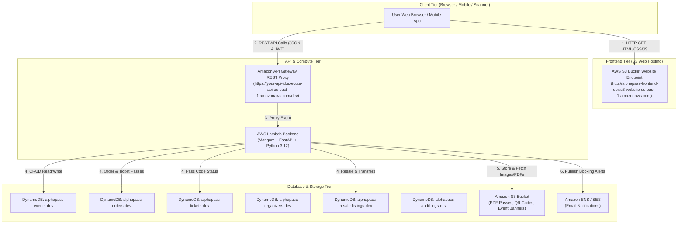

# AlphaPass Serverless System Integration & Frontend SDK Guide

This guide provides an end-to-end technical reference for **AlphaPass** (Event Ticketing, Resale Exchange & Gate Management System), linking **Amazon S3 Static Website Hosting**, **Amazon API Gateway**, **AWS Lambda (Python 3.12 + FastAPI + Mangum)**, **Amazon DynamoDB (12 tables)**, and **Amazon S3 Asset Bucket**.

---

## 🏛️ 1. Architecture Flow Diagram



---

## 🌐 2. Frontend Architecture & Shared SDK (`app-api.js`)

The frontend is a zero-dependency, ultra-fast Single Page Application (SPA) built using Vanilla HTML5, Bootstrap 5, and JavaScript.

### SDK Features ([frontend/js/app-api.js](file:///home/haadi/Desktop/AWS%20Cloud/Azubi-AWS-AI/Team%20Alpha/alphapass/frontend/js/app-api.js)):

1. **`apiFetch(path, options)`**:
   - Universal wrapper around browser `fetch()`.
   - Automatically injects JWT Bearer tokens from `localStorage` (`access_token`, `organizer_token`, `admin_token`).
   - Translates FastAPI validation errors into human-readable error strings.
   - Applies `normalizeResponse()` to unwrap pagination containers (`{ items: [...], total: ... }`) and attach default banner fallbacks (`image_url`).

2. **`CartManager`**:
   - Manages local ticket pass shopping cart state in `localStorage` (`alphapass_cart`).
   - Methods: `getCart()`, `addItem(item)`, `removeItem(index)`, `clear()`, `getTotal()`, `updateCartBadge()`.

3. **`sanitizeHTML(str)`**:
   - Escapes user inputs and API responses before dynamic DOM insertion to guarantee XSS prevention.

4. **`showToast(message, type)`**:
   - Renders floating alert notifications (`success`, `danger`, `warning`, `info`) with auto-dismissal.

---

## 📡 3. Complete API Endpoint Specification

### Public & Customer Endpoints

#### 1. System Health
- **`GET /health`**
  - **Auth**: None
  - **Returns**: `{ "status": "ok", "app": "AlphaPass API", "version": "2.0.0" }`

#### 2. Event Catalog & Details
- **`GET /events`**
  - **Query Params**: `search` (string), `category_id` (string), `city` (string), `page` (int), `limit` (int)
  - **Returns**: `{ "items": [EventResponse], "total": int, "page": int, "limit": int }`
- **`GET /events/{id}`**
  - **Returns**: `EventResponse` with nested `ticket_types` array.
- **`GET /events/categories`**
  - **Returns**: `[EventCategoryResponse]`

#### 3. Orders & Guest Checkout
- **`POST /orders`**
  - **Body**:
    ```json
    {
      "event_id": "evt-uuid",
      "guest_name": "Alice Johnson",
      "guest_email": "alice@example.com",
      "guest_phone": "+233240000000",
      "items": [
        { "ticket_type_id": "tt-gen", "quantity": 2, "attendee_name": "Alice Johnson", "attendee_email": "alice@example.com" }
      ],
      "promo_code": "ALPHA10",
      "payment_method": "Mobile Money"
    }
    ```
  - **Returns**: `OrderResponse` including generated ticket pass objects and S3 QR code URLs.
- **`POST /orders/lookup`**
  - **Body**: `{ "email": "alice@example.com", "order_id": "ORD-123456" }`
  - **Returns**: `[OrderResponse]`
- **`POST /orders/validate-promo`**
  - **Body**: `{ "code": "ALPHA10", "event_id": "evt-uuid" }`
  - **Returns**: `{ "valid": true, "discount_percent": 10.0, "message": "Promo code applied!" }`
- **`POST /orders/{id}/cancel`**
  - **Body**: `{ "guest_email": "alice@example.com" }`
  - **Returns**: `{ "message": "Order cancelled" }`

#### 4. Digital Passes & PDF Generation
- **`GET /tickets/{ticket_code}`**
  - **Returns**: `TicketResponse` (status, attendee, event_title, qr_code_url)
- **`GET /tickets/{ticket_code}/pdf`**
  - **Returns**: Binary PDF Stream (`application/pdf`) generated on-the-fly via ReportLab.

#### 5. Secondary Resale Market & Transfers
- **`GET /resale/listings`**
  - **Returns**: `[ResaleListingResponse]` (asking_price, face_value, ticket_code, event_title)
- **`POST /resale/tickets/{ticket_code}`**
  - **Body**: `{ "seller_name": "Alice", "seller_email": "alice@example.com", "asking_price": 110.00 }`
  - **Returns**: `ResaleListingResponse`
- **`POST /resale/{listing_id}/purchase`**
  - **Body**: `{ "buyer_name": "Bob", "buyer_email": "bob@example.com" }`
  - **Returns**: Newly issued ticket pass for buyer.
- **`POST /transfers/{ticket_code}/transfer`**
  - **Query Params**: `guest_email` (string)
  - **Body**: `{ "recipient_name": "Charlie", "recipient_email": "charlie@example.com" }`
  - **Returns**: `{ "message": "Ticket transferred successfully" }`

---

### Organizer Portal Endpoints (Header: `Authorization: Bearer <organizer_token>`)

- **`POST /auth/organizer/signup`**: Register organizer account (`full_name`, `business_name`, `email`, `password`).
- **`POST /auth/organizer/login`**: Authenticate organizer (`email`, `password`) -> returns JWT `access_token`.
- **`GET /organizer/dashboard`**: Fetch revenue metrics, net earnings, total tickets sold, pending payouts.
- **`GET /events/organizer/my-events`**: List events created by authenticated organizer.
- **`POST /events/organizer`**: Create new event (`title`, `description`, `venue_name`, `city`, `starts_at`, `ends_at`, `banner_image_url`).
- **`POST /events/organizer/{id}/publish`**: Transition event status from `draft` to `published`.
- **`POST /events/organizer/{id}/ticket-types`**: Add ticket pass tier (`name`, `price`, `quantity`, `purchase_limit`).
- **`POST /events/upload-banner`**: Upload cover image directly to S3 bucket -> returns `{ "image_url": "https://..." }`.
- **`GET /organizer/events/{id}/attendees`**: Export attendee list (`format=json` or `format=csv`).
- **`POST /checkin/scan`**: Gate scanner check-in (`ticket_code`) -> marks pass as used.

---

### Admin Governance Endpoints (Header: `Authorization: Bearer <admin_token>`)

- **`POST /auth/admin/login`**: Authenticate admin (`email`, `password`) -> returns JWT `access_token`.
- **`GET /admin/dashboard`**: Total platform revenue, published events, total organizers, commission fees.
- **`GET /admin/events`**: List all platform events including draft/pending.
- **`PUT /admin/events/{id}/approve`**: Approve or reject pending event (`approved: bool`).
- **`PUT /admin/config/commission`**: Set global commission percentage (`commission_percent: float`).
- **`POST /admin/categories`**: Create event category (`name`, `description`).

---

## 🛠️ 4. Integration Best Practices & Security

1. **JWT Storage**: Store organizer and admin tokens in `localStorage` under `organizer_token` and `admin_token`.
2. **Atomic Inventory & Race Condition Prevention**:
   - Order processing utilizes DynamoDB conditional updates (`ADD quantity_sold`) to prevent overselling under high concurrency.
   - Promo code redemption uses atomic DynamoDB conditional expressions (`ADD times_used 1`).
3. **CORS Policy**: Configured in FastAPI (`CORSMiddleware`) allowing cross-origin requests from any frontend S3 website endpoint.
